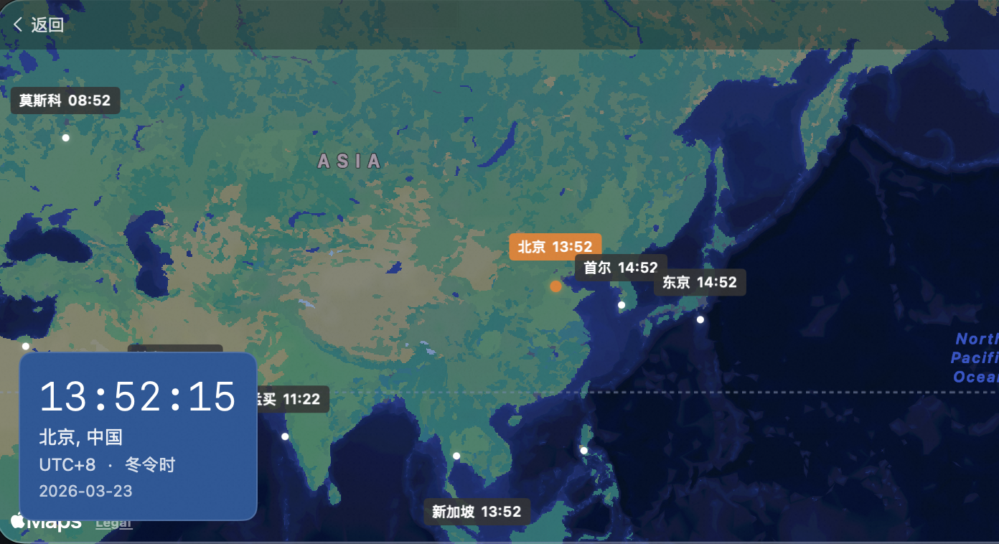

# MyTime

一款 macOS 菜单栏应用，集时间、日历、世界时钟于一体。


## 功能特性

### 菜单栏集成
- 在 macOS 菜单栏显示当前日期，格式为 `MM月DD日`
- 悬停提示显示完整日期和农历信息
- 左键点击打开日历弹出窗口
- 右键点击显示上下文菜单（退出选项）

### 日历视图
- **月视图**：网格显示当月所有日期
- **年视图**：单页概览全部 12 个月份
- **导航**：上/下月切换按钮和"今天"快速导航
- **农历显示**：每个日期显示对应的农历日期
- **节假日标识**：
  - 红色"休"标签表示法定节假日
  - 灰色"班"标签表示周末调休工作日
- **节日显示**：
  - 红色文字显示农历节日和公历节日
  - 绿色文字显示二十四节气
- **日期选择**：点击选中日期，蓝色高亮显示
- **今日标记**：当前日期蓝色边框




### 世界时钟
- **交互式地图**：基于 MapKit 的世界地图，带城市标记
- **实时更新**：每秒更新时间显示
- **城市时间显示**：显示全球多个主要城市时间
- **当前位置**：自动检测并高亮显示当前时区
- **悬停/点击交互**：悬停或点击查看城市详情
- **全屏模式**：可切换全屏显示
- **时区信息**：显示 UTC 偏移量和夏令时状态

### 黄历功能
- **每日概要**：显示宜（适合做的事项）和忌（避免做的事项）
- **详细信息**：完整的黄历信息，包括：
  - **五行**：金木水火土
  - **冲煞**：冲、煞方位
  - **彭祖**：每日忌口字符
  - **吉神/凶神**：吉神和凶神方位
  - **星宿**：二十八星宿
- **时辰吉凶**：12 个时辰（每时辰 2 小时）的吉凶指示
- **宜忌网格**：宜/忌事项的可视化网格显示


### 国际化支持
- 支持多种语言：简体中文、English、日语、韩语
- 所有 UI 字符串均已本地化

## 技术栈

- **框架**：SwiftUI + AppKit（混合开发）
- **语言**：Swift 5.9+
- **最低 macOS 版本**：macOS 14.0+
- **依赖库**：
  - [SwiftDate](https://github.com/malcommac/SwiftDate)：日期时间工具
  - [lunar-swift](https://github.com/6tail/lunar-swift)：农历计算库

## 项目结构

```
Sources/MyTime/
├── App/
│   ├── AppDelegate.swift      # 菜单栏管理
│   └── MyTimeApp.swift       # 应用入口
├── Core/
│   ├── Models/
│   │   └── WorldCity.swift   # 城市数据模型
│   ├── Services/
│   │   ├── CityDataService.swift      # 城市/时区管理
│   │   ├── HolidayService.swift       # 节假日数据 (2001-2026)
│   │   └── LunarCalendarService.swift # 农历计算服务
│   └── Utils/
├── Features/
│   ├── Almanac/
│   │   ├── AlmanacDetailPopup.swift   # 弹出窗口组件
│   │   └── AlmanacDetailView.swift    # 完整详情视图
│   ├── Calendar/
│   │   ├── CalendarContainerView.swift # 主日历容器
│   │   ├── CalendarGridView.swift     # 日历网格
│   │   └── CalendarPopoverView.swift  # 弹出窗口版本
│   └── WorldClock/
│       ├── WorldClockMapView.swift    # 地图组件
│       └── WorldClockPopupView.swift  # 带控制栏的弹出窗口
└── Resources/
    ├── Cities.json           # 世界城市数据
    └── Localizable.xcstrings # 本地化字符串
```

## 可用命令

| 命令 | 说明 |
| --- | --- |
| `swift run` / `swift run app` | 运行应用 |
| `swift run MyTime` | 运行应用（完整名称） |
| `swift run dmg` | 构建 release 版本并创建 DMG |

## 使用说明

1. **启动**：应用作为菜单栏程序运行（无 Dock 图标）
2. **查看日历**：点击菜单栏中的日期
3. **切换月份**：使用箭头按钮切换，或点击"今天"返回
4. **查看世界时钟**：在侧边栏选择"World Clock"
5. **查看黄历**：在日历中选中日期，底部显示黄历概要
6. **退出应用**：右键点击菜单栏图标，选择"Quit MyTime"

## 开源许可

MIT License
